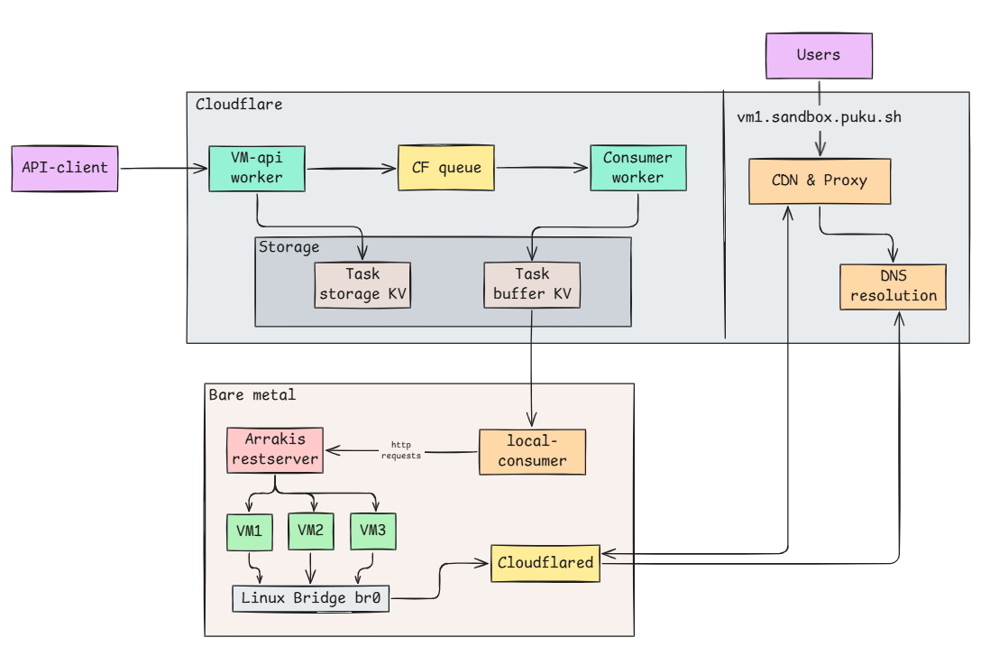
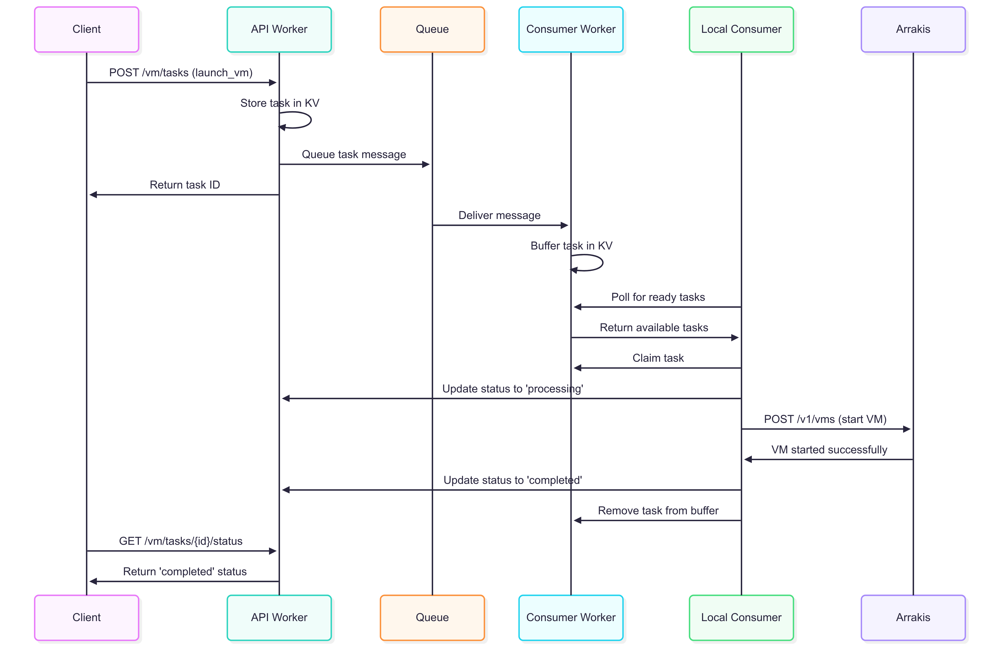

# VM Management Task Queue System

A scalable, distributed VM management system built with Cloudflare Workers and Arrakis. This system allows you to manage VMs through a REST API with reliable task processing using Cloudflare's global infrastructure.



## Introduction

This project provides a complete task queue solution for VM management operations. It decouples VM requests from execution, allowing for reliable, scalable, and asynchronous VM operations on your bare metal servers.

**Key Benefits:**
- 🌍 **Global Scale**: Leverages Cloudflare's edge network
- 🔄 **Reliable Processing**: Queue-based with automatic retries
- 🔒 **Secure**: VMs run on your infrastructure, API runs on Cloudflare
- 📊 **Observable**: Full task tracking and status monitoring
- ⚡ **Fast**: Low-latency API responses with background processing

## Architecture


### Components

1. **API Worker** (Cloudflare Workers)
   - REST API for task submission and status tracking
   - Stores tasks in KV storage
   - Queues tasks for processing

2. **Consumer Worker** (Cloudflare Workers)
   - Processes queue messages
   - Buffers tasks for local consumers
   - Manages task lifecycle

3. **Local Consumer** (Node.js on Bare Metal)
   - Polls for VM tasks
   - Executes operations via Arrakis API
   - Reports completion back to API

4. **Storage & Queue**
   - **Task Storage KV**: Persistent task data
   - **Task Buffer KV**: Temporary task buffer
   - **Queue**: Reliable message delivery

## Example Flow

Here's how a typical VM launch request flows through the system:



## Deployment Guide

### 1. Prerequisites

- Cloudflare account with Workers enabled
- Node.js 18+ installed
- Arrakis server running on bare metal
- Wrangler CLI: `npm install -g wrangler`

### 2. Create KV Namespaces

```bash
# Create task storage namespace
wrangler kv:namespace create "TASK_STORAGE"
wrangler kv:namespace create "TASK_STORAGE" --preview

# Create task buffer namespace  
wrangler kv:namespace create "TASK_BUFFER"
wrangler kv:namespace create "TASK_BUFFER" --preview
```

Copy the generated namespace IDs for the next step.

### 3. Create Queue

```bash
# Create main queue
wrangler queues create vm-task-queue

# Optional: Create dead letter queue for failed messages
wrangler queues create vm-task-dlq
```

### 4. Deploy API Worker

```bash
cd api-worker
npm install

# Update wrangler.toml with your KV namespace IDs:
# binding = "TASK_STORAGE"
# id = "your-task-storage-kv-id"

wrangler deploy
```

### 5. Deploy Consumer Worker

```bash
cd consumer-worker
npm install

# Update wrangler.toml with your KV namespace IDs:
# binding = "TASK_BUFFER" 
# id = "your-task-buffer-kv-id"

wrangler deploy
```

### 6. Start Local Consumer

```bash
cd local-consumer
npm install

# Configure environment
cp .env.example .env

# Edit .env with your URLs:
# CONSUMER_WORKER_URL=https://vm-consumer-worker.your-subdomain.workers.dev
# API_WORKER_URL=https://vm-api-worker.your-subdomain.workers.dev
# ARRAKIS_URL=http://127.0.0.1:8080

# Start the consumer
npm run dev
```

## Testing the System

### 1. Health Checks

```bash
# Test API Worker
curl https://vm-api-worker.your-subdomain.workers.dev/health

# Test Consumer Worker
curl https://vm-consumer-worker.your-subdomain.workers.dev/health
```

### 2. Launch a VM

```bash
curl -X POST https://vm-api-worker.your-subdomain.workers.dev/vm/tasks \
-H "Content-Type: application/json" \
-d '{
  "type": "launch_vm",
  "payload": {
    "vmName": "test-vm-001",
    "vmConfig": {
      "memory": "2G"
    },
    "targetServer": "production"
  }
}'
```

Expected response:
```json
{
  "success": true,
  "taskId": "a1b2c3d4-e5f6-7890-abcd-ef1234567890",
  "status": "pending",
  "message": "VM launch vm task queued successfully"
}
```

### 3. Check Task Status

```bash
curl https://vm-api-worker.your-subdomain.workers.dev/vm/tasks/a1b2c3d4-e5f6-7890-abcd-ef1234567890/status
```

### 4. Run Command in VM

```bash
curl -X POST https://vm-api-worker.your-subdomain.workers.dev/vm/tasks \
  -H "Content-Type: application/json" \
  -d '{
    "type": "run_command",
    "payload": {
      "vmName": "test-vm-001",
      "command": "echo Hello from VM",
      "blocking": true
    }
  }'
```

### 5. Stop/Delete VM

```bash
# Stop VM
curl -X POST https://vm-api-worker.your-subdomain.workers.dev/vm/tasks \
  -H "Content-Type: application/json" \
  -d '{
    "type": "stop_vm",
    "payload": {
      "vmName": "test-vm-001"
    }
  }'

# Delete VM
curl -X POST https://vm-api-worker.your-subdomain.workers.dev/vm/tasks \
  -H "Content-Type: application/json" \
  -d '{
    "type": "delete_vm",
    "payload": {
      "vmName": "test-vm-001"
    }
  }'
```

### 6. List All Tasks

```bash
curl https://vm-api-worker.your-subdomain.workers.dev/vm/tasks
```

## Supported Operations

| Operation | Description | Payload |
|-----------|-------------|---------|
| `launch_vm` | Start a new VM | `vmName`, `vmConfig` (kernel, rootfs, etc.) |
| `delete_vm` | Destroy a VM | `vmName` |
| `stop_vm` | Stop a running VM | `vmName` |
| `pause_vm` | Pause a running VM | `vmName` |
| `snapshot_vm` | Create VM snapshot | `vmName`, `snapshotId` |
| `run_command` | Execute command in VM | `vmName`, `command`, `blocking` |

## Monitoring

### View Logs

```bash
# API Worker logs
wrangler tail --name vm-api-worker

# Consumer Worker logs  
wrangler tail --name vm-consumer-worker

# Local Consumer logs (in terminal where it's running)
```

### Check System Status

```bash
# Queue information
wrangler queues info vm-task-queue

# Buffer statistics
curl https://vm-consumer-worker.your-subdomain.workers.dev/stats

# Ready tasks
curl https://vm-consumer-worker.your-subdomain.workers.dev/tasks/ready
```

## Troubleshooting

### Common Issues

1. **500 Internal Server Error**
   - Check KV namespace IDs in `wrangler.toml`
   - Ensure queue exists: `wrangler queues info vm-task-queue`

2. **Consumer Connection Failed**
   - Verify worker URLs in `.env`
   - Check workers are deployed: `wrangler deployments list`

3. **Arrakis Connection Failed**
   - Ensure Arrakis server is running: `curl http://127.0.0.1:8080/v1/health`
   - Check ARRAKIS_URL in `.env`

4. **Tasks Not Processing**
   - Check local consumer logs
   - Verify consumer worker is receiving messages: `wrangler tail`

### Debug Commands

```bash
# Test Arrakis directly
curl http://127.0.0.1:8080/v1/health
curl http://127.0.0.1:8080/v1/vms

# Check worker deployments
wrangler deployments list

# View KV contents
wrangler kv:key list --binding=TASK_STORAGE --prefix=task:
```

## Configuration

### Environment Variables

| Variable | Description | Default |
|----------|-------------|---------|
| `CONSUMER_WORKER_URL` | Consumer Worker URL | Required |
| `API_WORKER_URL` | API Worker URL | Required |
| `ARRAKIS_URL` | Arrakis server URL | `http://127.0.0.1:8080` |
| `DEFAULT_KERNEL` | Default kernel path | `/opt/arrakis/vmlinux.bin` |
| `DEFAULT_ROOTFS` | Default rootfs path | `/opt/arrakis/rootfs.ext4` |
| `DEFAULT_INITRAMFS` | Default initramfs path | `/opt/arrakis/initramfs.cpio.gz` |

### Queue Configuration

In `consumer-worker/wrangler.toml`:

```toml
[[queues.consumers]]
queue = "vm-task-queue"
max_batch_size = 10          # Process up to 10 messages at once
max_batch_timeout = 30       # Wait max 30s to fill batch
max_retries = 3              # Retry failed messages 3 times
dead_letter_queue = "vm-task-dlq"  # Failed messages go here
```

## License

This project is open source and available under the MIT License.